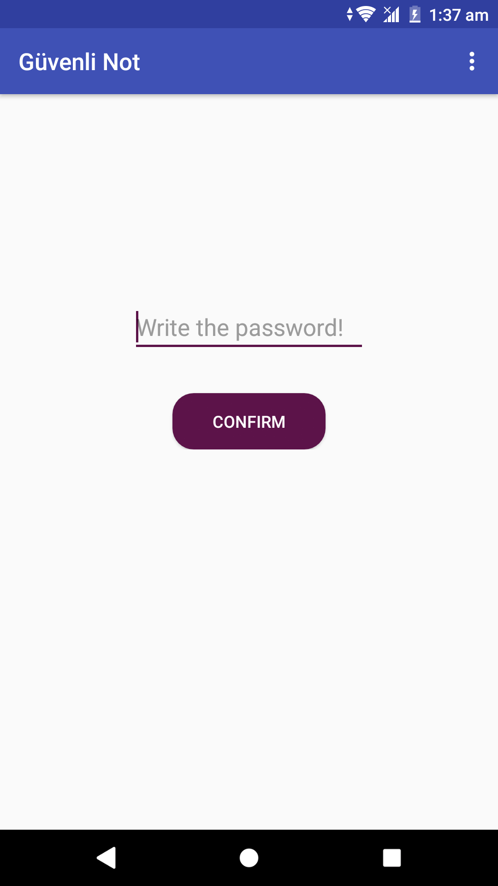
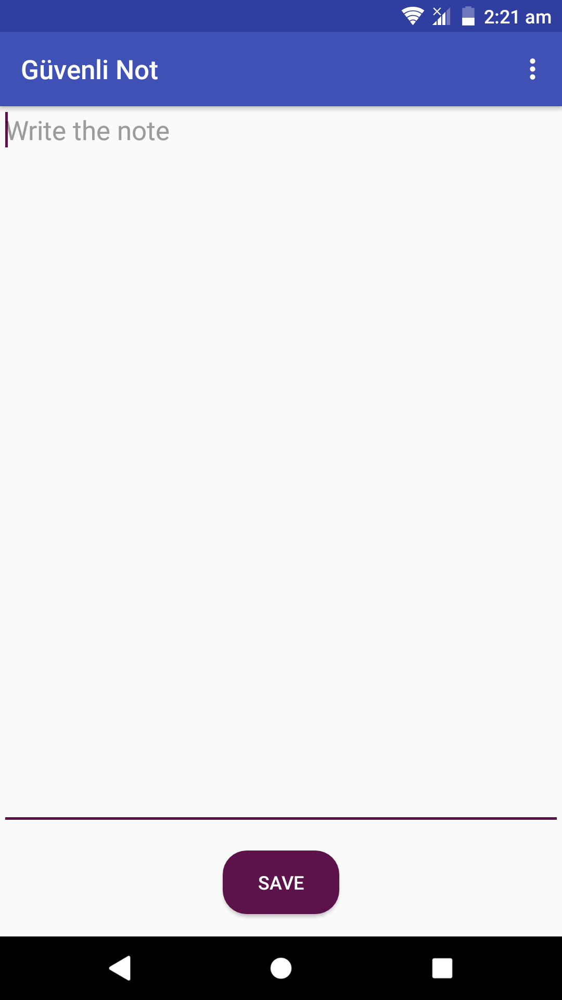
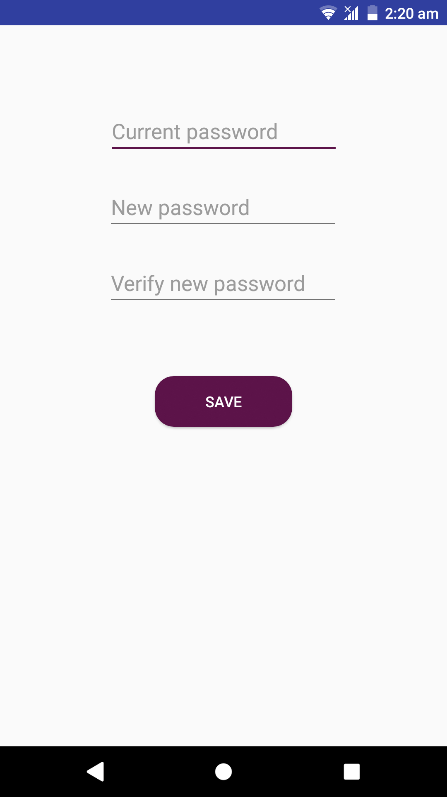
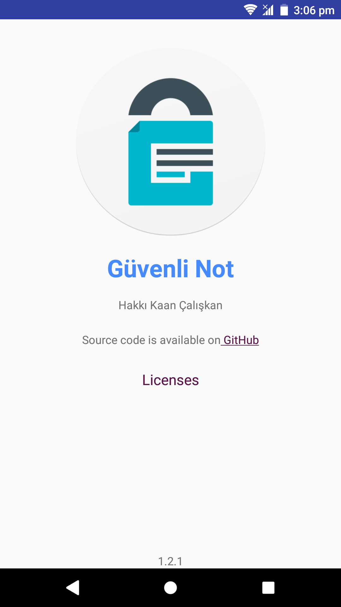

<h1 align=center>

</h1>

# Secure Note App for Android

This app saves your notes **locally** with Base64 (for notes) and SHA-512 (for password) encoding/encryption.

This app supports 5.0-9.0 Android versions.

## Open Source Libraries:

- [Toasty](https://github.com/GrenderG/Toasty) for error/success messages
- [material-about-library](https://github.com/daniel-stoneuk/material-about-library) for beautiful about page
- [Kotlin](https://github.com/JetBrains/kotlin) app is written in Kotlin
- [AppUpdater](https://github.com/javiersantos/AppUpdater) for update checks
- [OkHttp](https://github.com/square/okhttp) to help AppUpdater
- [Anko](https://github.com/Kotlin/anko) for database
- **Android Support Libraries**, of course

## Screenshots

## GüvenliNot Logo

**Güvenli Not** logo is designed by [zularizal](https://github.com/zularizal).