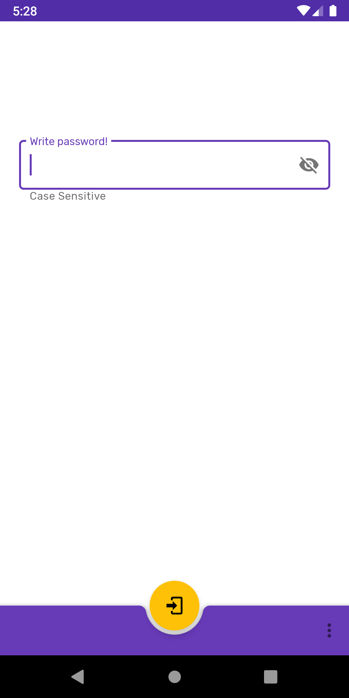
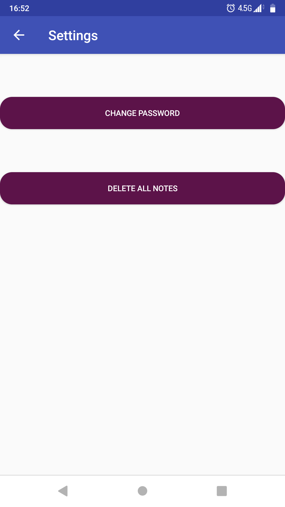
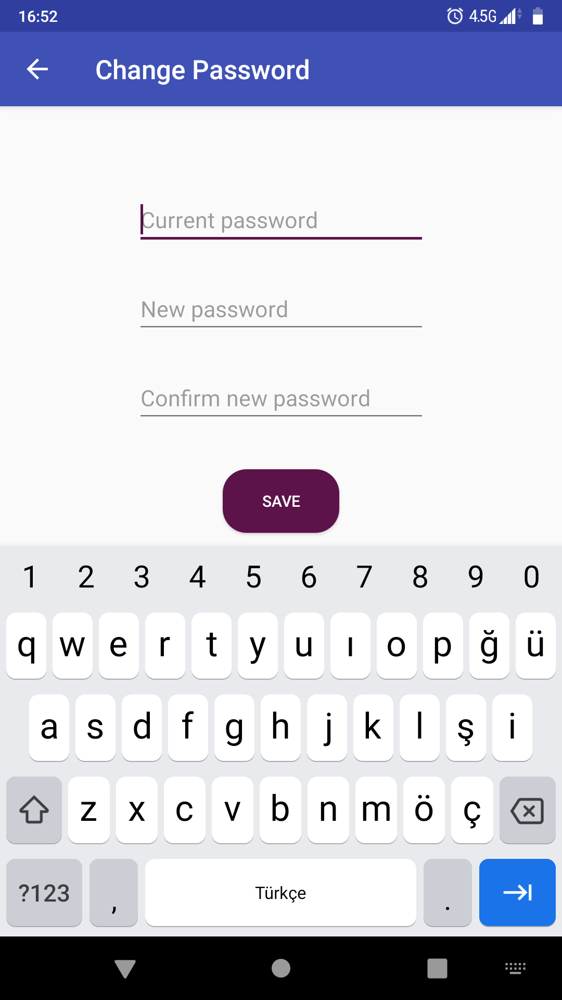
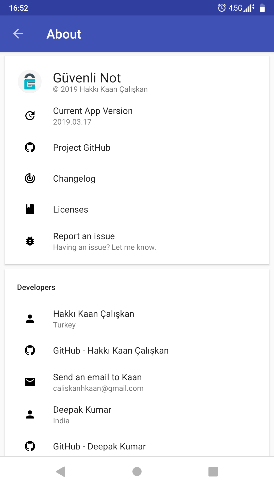
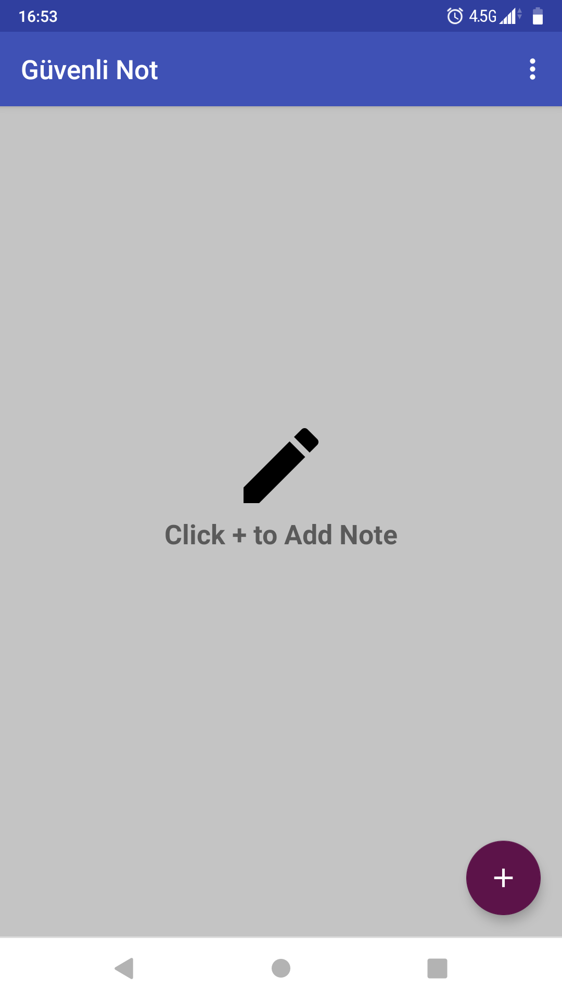

<h1 align=center>

</h1>

# Secure Note App for Android

This app saves your notes **locally** with Base64 (for notes) and SHA-512 (for password) encoding/encryption.

This app supports 5.0-9.0 Android versions.

## Open Source Libraries:

- [Attribouter](https://github.com/fennifith/Attribouter) for beautiful about page
- [Anko](https://github.com/Kotlin/anko) for Pleasant Android Development
- **Android support libraries**, of course

## Screenshots

