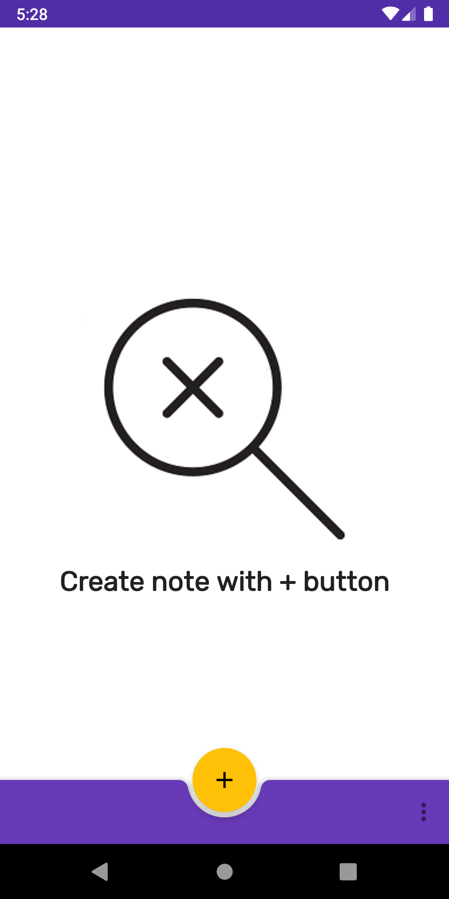
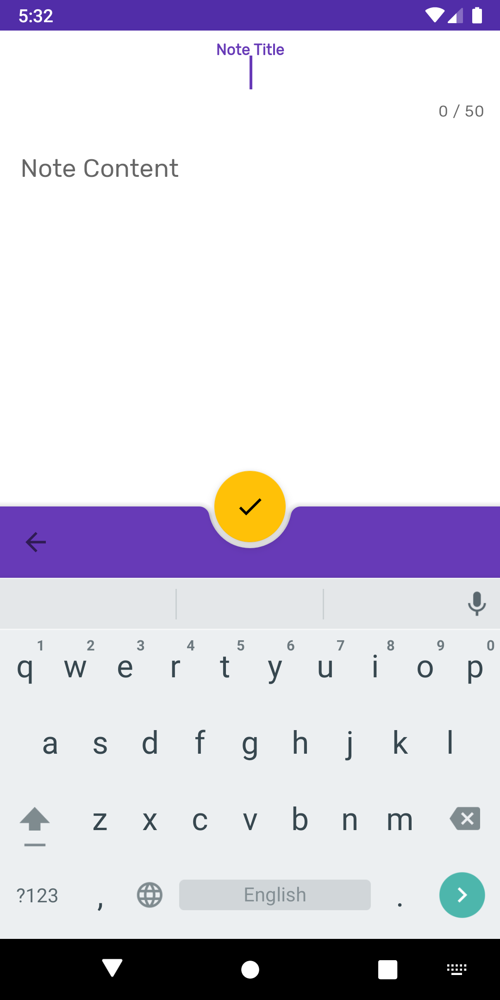
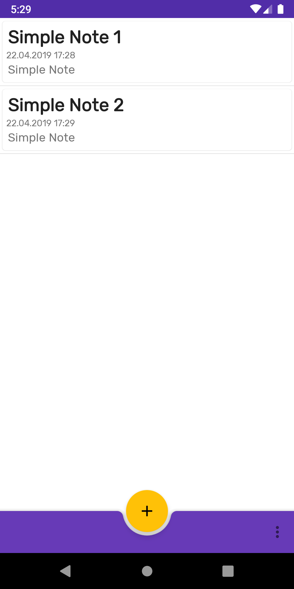
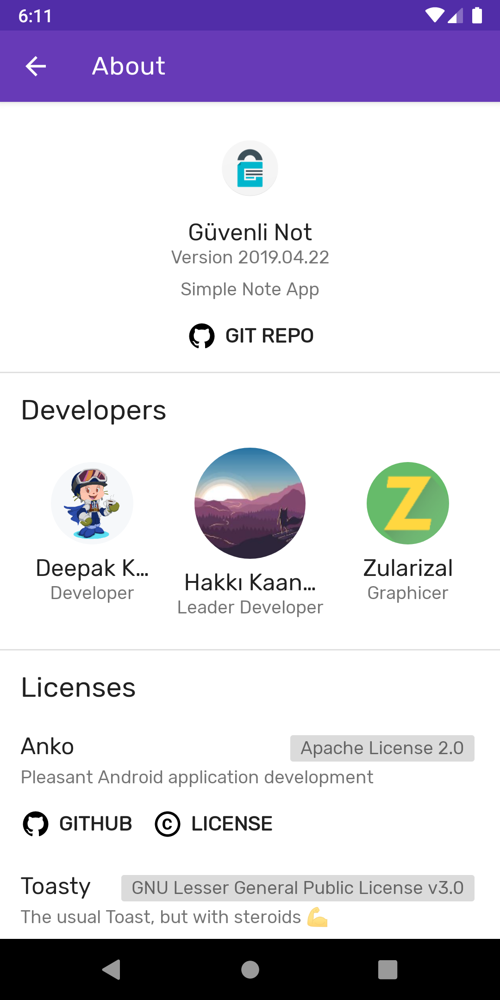

<h1 align=center>

</h1>

# Secure Note App for Android

This app saves your notes **locally** with Base64 (for notes) and SHA-512 (for password) encoding/encryption.

This app supports 5.0-9.0 Android versions.

## Open Source Libraries:

- [Toasty](https://github.com/GrenderG/Toasty) for error/success messages
- [material-about-library](https://github.com/daniel-stoneuk/material-about-library) for beautiful about page
- [Kotlin](https://github.com/JetBrains/kotlin) app is written in Kotlin
- [Anko](https://github.com/Kotlin/anko) for Pleasant Android Development
- [Room Persistence Library](https://developer.android.com/topic/libraries/architecture/room) for robust Database handling
- **Androidx libraries**, of course

## Screenshots

## GüvenliNot Logo

**Güvenli Not** logo is designed by [zularizal](https://github.com/zularizal).